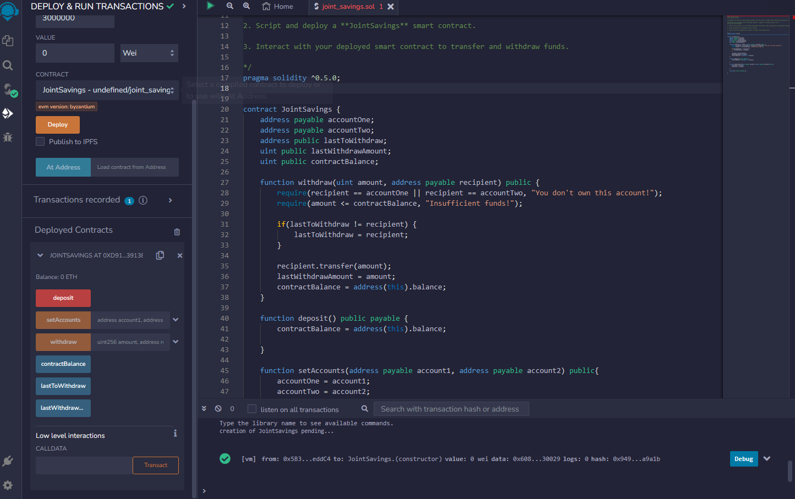

# Savings_account

## Cooperative Savings Contract

This archive encompasses a smart contract, crafted in Solidity, designed for the simulation of a collaborative savings account for a hypothetical fintech organization. The contract empowers a duo of users to operate a shared savings account, facilitating the insertion and retrieval of funds. To actualize its fiscal operations, the Solidity smart contract is embedded with ether-handling functions.

## Inside the Box?

At the heart of this repository lies the Solidity blueprint named `collaborative_savings.sol`. This design guides the instantiation and supervision of a co-managed savings account.

## Guidelines

The `CooperativeSavings` contract was articulated, cross-checked, and instantiated within the Remix VM (London) made accessible by the Remix IDE.

**Stage 1: Construct a Cooperative Savings Account Contract using Solidity**
The contract blueprint was realized by adhering to the guidelines laid out in the template file `collaborative_savings.sol`.

**Stage 2: Verification and Instantiation of the Contract**
Post validation, the contract was free from discrepancies and was subsequently initialized within the Remix VM (London).

**Stage 3: Engage with the Activated Smart Contract**
Upon deployment, the contract was subject to the following procedures:

- The `designateAccounts` method was employed to earmark the Ethereum addresses vested with withdrawal rights.

**Account Assignation**

Ether allocation to the contract was exemplified by these sequences:

- **Sequence 1**: Transference of 1 ether, quantified in wei.
  - Sequence 1 Visualization

- **Sequence 2**: Channeling 10 ether, quantified in wei.
  - Sequence 2 Visualization
  
- **Sequence 3**: Allocation of 5 ether.
  - Sequence 3 Visualization

The extraction feature of the contract was examined through:

- **Extraction 1**: 5 Ether directed towards `accountOne`.
  - Extraction 1 Visualization

- **Extraction 2**: 10 Ether directed towards `accountTwo`.
  - Extraction 2 Visualization

Functions like `accountBalance`, `previousWithdrawalEntity`, and `lastExtractedSum` corroborated the transactions.

# Visuals

**Wrap-up**

The `CooperativeSavings` contract was efficaciously brought to life and validated in the Remix VM (London) environment. It mirrored the quintessential attributes of a collaborative savings account, furnishing mechanisms to add and retrieve financial assets. The ether-handling functionalities inscribed in the contract adeptly mirrored the account movements. Future enhancements can draw inspiration from this contract, elaborating on multifaceted shared account capabilities apt for pragmatic fintech solutions.
